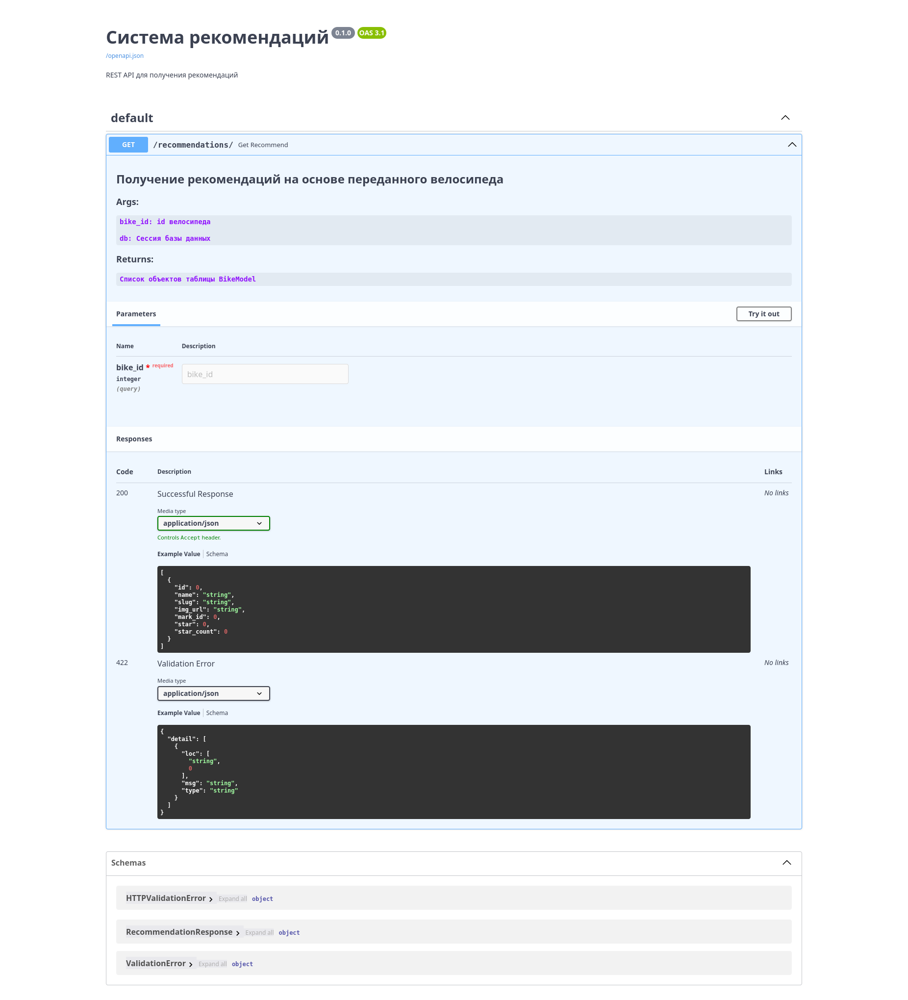
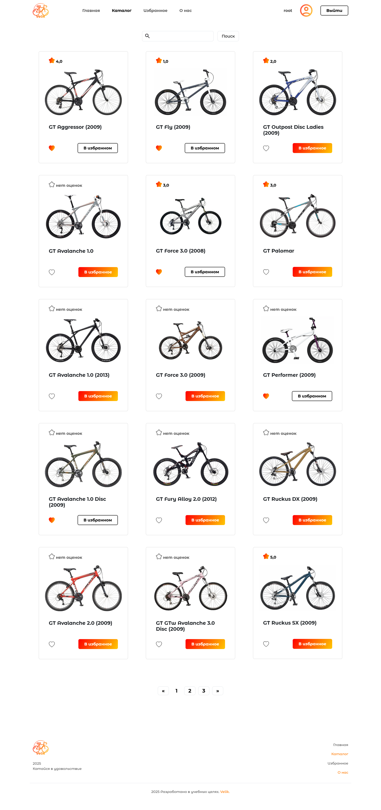
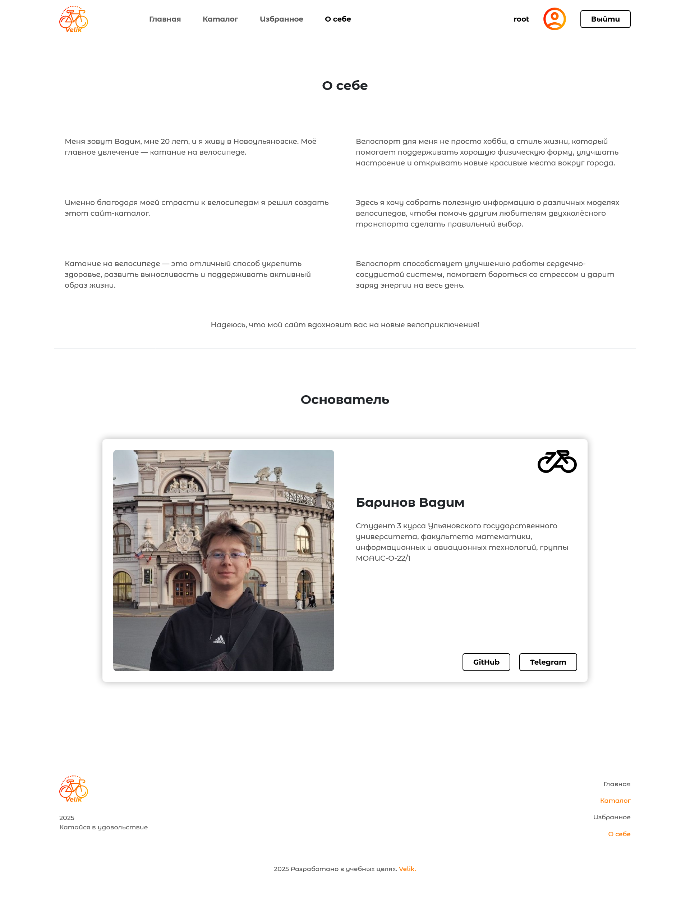
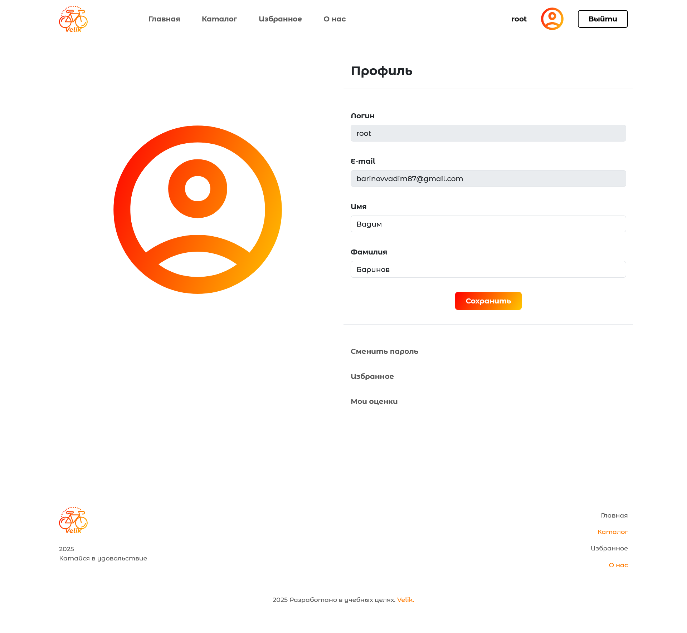
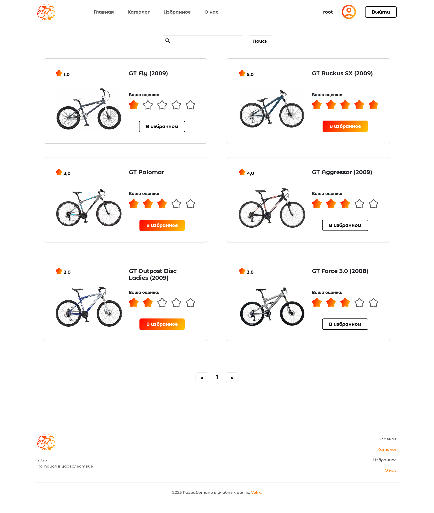
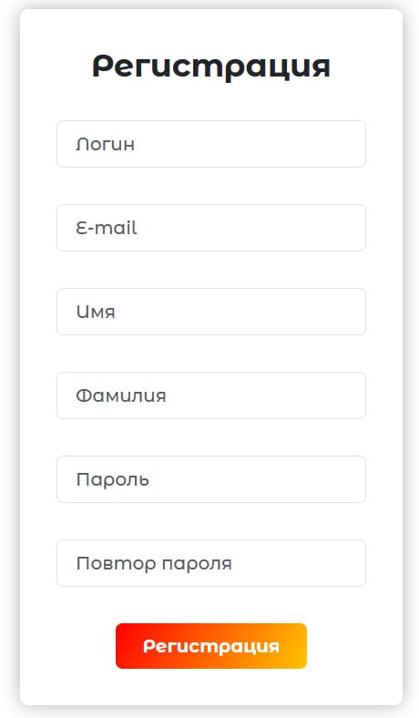

# Web-каталог велосипедов Velik со встроенной системой рекомендаций

#### Проект состоит из:

1. Портал, написанный с использованием фреймворка _Django_
2. База данных _MySQL_
3. _FastAPI_ сервис для получения рекомендаций

Приложение является многоконтейнерным, запускается с помощью _Docker Compose_

---

## Запуск проекта

#### Для успешной работы проекта необходимо выполнить следующие шаги:

1. Установить _Docker_ на свой компьютер, если он еще не установлен: [_Get Started with Docker_](https://www.docker.com/get-started)

2. Склонировать данный репозиторий

```bash
    git clone https://github.com/VadimBarinov/Velik-App.git
```

3. Перейти в директорию с проектом

```bash
    cd Velik-App
```

4. Запустить приложение

```bash
   docker-compose up
```

#### После запуска приложения будет загружен тестовый набор данных из дампа базы данных:

```bash
    ./db/db_site_velik_dump.sql
```

## Доступ к админ панели

#### Для доступа к _Admin_ панели необходимо использовать следующие параметры:

- Login : root
- Email : root@root.com
- Password : root12345

## Подключение к проекту

После выполнения подготовительных действий проект будет доступен по адресу

```bash
    http://localhost:80/
```

Проект также будет доступен по внутреннему _ip_ адресу вашего компьютера

---

# Описание API для получения рекомендаций

API доступно по адресу:

```bash
    http://localhost:8080/
```

Также доступ к API будет по внутреннему _ip_ адресу вашего компьютера

## Реализован GET запрос (/recommendations/) для формирования рекомендаций

#### Args:

    - bike_id: id велосипеда
    - db: Сессия базы данных

#### Returns:

    - Список объектов таблицы BikeModel

#### Example (bike_id=15094):

Request URL

```bash
  http://localhost:8080/recommendations/?bike_id=15094
```

Response body

```json
[
  {
    "id": 15084,
    "name": "Avalanche 1.0 (2013)",
    "slug": "avalanche-1-0-2013",
    "img_url": "bikes/2025/03/29/avalanche-1-0-2013.png",
    "mark_id": 3473,
    "star": 0,
    "star_count": 0
  },
  {
    "id": 15107,
    "name": "Stomper 24 (2009)",
    "slug": "stomper-24-2009",
    "img_url": "bikes/2025/03/29/stomper-24-2009.png",
    "mark_id": 3473,
    "star": 0,
    "star_count": 0
  },
  {
    "id": 15078,
    "name": "Aggressor (2009)",
    "slug": "aggressor-2009",
    "img_url": "bikes/2025/03/29/aggressor-2009.png",
    "mark_id": 3473,
    "star": 4,
    "star_count": 2
  }
]
```

## Swagger UI

Swagger UI будет доступен по адресу:

```bash
    http://localhost:8080/docs
```

Также доступ будет по внутреннему _ip_ адресу



---

# Описание портала на Django

#### Функционал сайта:

- Можно просмотреть характеристики каждого велосипеда
- Есть возможность входа, регистрации, а также редактирования профиля
- Пользователь может добалять в избранное, а также выставлять оценки
- Также выводятся рекомендации на странице конкретного велосипеда (используется _API_ для получения рекомендаций)

## Главная


## Каталог



## Страница велосипеда

.png>)

## О себе



## Профиль пользователя



## Мои оценки



## Форма входа


## Форма регистрации


